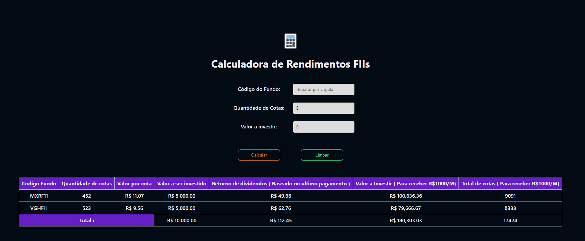

# Calculadora de Dividendos para Fundos Imobiliários

Uma ferramenta online para calcular dividendos e estimar cotas de fundos imobiliários.

## Visão Geral

A Calculadora de Dividendos para Fundos Imobiliários é uma página web concebida para simplificar o cálculo de dividendos de fundos imobiliários, com base na quantidade desejada de cotas.



## Instruções de Uso

Para utilizar esta calculadora, siga estas etapas simples:

### Passo 1: Construção da Imagem Docker

Primeiramente, crie a imagem Docker com o seguinte comando:
```bash
docker build -t calculadora-fiis .
```

### Passo 2: Execução do Contêiner Docker

Após a criação da imagem, execute o seguinte comando para iniciar o contêiner:
```bash
docker run -p 5000:5000 calculadora-fiis:latest
```

### Passo 3: Acesso à Calculadora

Abra o seu navegador e acesse o seguinte link: [http://127.0.0.1:5000](http://127.0.0.1:5000)

## Fonte de Dados

Os dados utilizados neste projeto são obtidos a partir da URL [https://statusinvest.com.br/fundos-imobiliarios/busca-avancada](https://statusinvest.com.br/fundos-imobiliarios/busca-avancada). A coleta de dados é realizada utilizando a biblioteca *requests*, o que resulta em um desempenho eficiente durante o cálculo.

Espero que esta calculadora seja uma ferramenta útil para ajudar você a estimar dividendos e cotas de fundos imobiliários de forma conveniente e precisa.

**Obs: Os calculos sao baseados nos ultimos dividendo pagos, este calculo não é 100% preciso, serve apenas para ter uma noção de ganhos.**